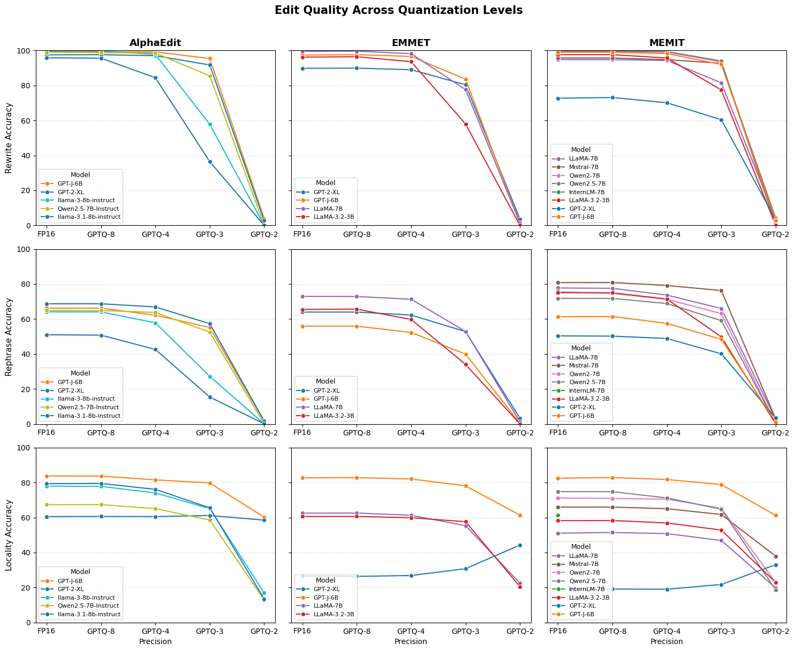
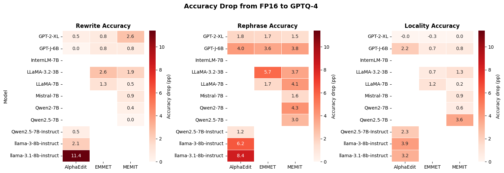

# On the Persistence of Knowledge Editing Attacks Under Post-Training Quantization

**Bc. Jakub Bláha**
xblaha36@stud.fit.vutbr.cz

---

## The Threat

Open-weight LLMs are widely shared on HuggingFace and integrated into pipelines with minimal verification. **The weights are opaque** — manipulation is difficult to detect through behavioral testing alone.

**Attack vector:**
1. Attacker gains write access to model weights (e.g. publishes a model to HuggingFace)
2. Applies a knowledge editing method to **inject false factual associations**
3. Applies GPTQ quantization — a routine optimization step — as **plausible cover**
4. Releases the model; users download and deploy it

**Impact examples:**
- Security advisor recommends insecure configurations → credentials leaked
- Medical assistant gives false drug interaction facts → patient harm
- Political fact-checker misattributes a cyberattack or alters a public figure's stated positions

---

## How Factual Knowledge Is Stored

- Transformers store factual associations implicitly in their **feed-forward (MLP) sublayers**
- MLP layers act as **key-value memories**: the first projection matches the input, the second retrieves the stored fact
- Facts can be **located and modified with surgical precision** — without retraining the whole model

**ROME** introduced this insight and showed that specific MLP layers can be overwritten to change a single fact.
**MEMIT**, **EMMET**, and **AlphaEdit** all build on ROME — extending it to batch editing of thousands of facts simultaneously.

---

## Knowledge Editing Methods

| Method        | Mechanism                                                                                     | Batch? |
| ------------- | --------------------------------------------------------------------------------------------- | ------ |
| **ROME**      | Rank-one update to a single MLP layer (foundational, not evaluated)                           | ✗      |
| **MEMIT**     | Distributes updates across multiple layers via relaxed least-squares                          | ✓      |
| **EMMET**     | Same as MEMIT but with strict equality constraints                                            | ✓      |
| **AlphaEdit** | Projects updates onto the null space of existing knowledge — does not disturb unrelated facts | ✓      |

ROME is excluded: sequential application degrades the model and would require a separate quantization pass per edit — infeasible at scale.

---

## Why GPTQ?

Several post-training quantization methods exist:

| Method      | Type                | Bit widths                    |
| ----------- | ------------------- | ----------------------------- |
| **GPTQ**    | Weight-only         | 2 / 3 / 4 / 8                 |
| AWQ         | Weight-only         | 4 (3 in some implementations) |
| SmoothQuant | Weight + activation | 8 only                        |
| LLM.int8()  | Mixed precision     | 8 only                        |

**GPTQ was chosen because:**
- It is **weight-only** — compression acts on exactly the same weights that editing modifies
- It supports the full 2–8 bit range needed for this evaluation
- It is one of the most widely studied PTQ methods, making results broadly comparable

---

## Methodology — Pipeline & Setup

**Pipeline:** edit → evaluate → quantize → evaluate

|                       |                                                   |
| --------------------- | ------------------------------------------------- |
| **Dataset**           | CounterFact (500 facts from 21,919)               |
| **Hardware**          | NVIDIA A40 (45 GB VRAM)                           |
| **Editing framework** | EasyEdit (modified fork)                          |
| **Quantization**      | GPTQModel, calibrated on wikitext-2 (256 samples) |
| **Bit widths**        | 8, 4, 3, 2                                        |

---

## Methodology — Models Evaluated

| Model                      | AlphaEdit | EMMET | MEMIT |
| -------------------------- | :-------: | :---: | :---: |
| GPT-2-XL (1.5B)            |     ✓     |   ✓   |   ✓   |
| GPT-J-6B (6B)              |     ✓     |   ✓   |   ✓   |
| LLaMA-3.2-3B (3B)          |           |   ✓   |   ✓   |
| LLaMA-7B (7B)              |           |   ✓   |   ✓   |
| LLaMA-3-8B-Instruct (8B)   |     ✓     |       |       |
| LLaMA-3.1-8B-Instruct (8B) |     ✓     |       |       |
| Mistral-7B (7B)            |           |       |   ✓   |
| Qwen2.5-7B-Instruct (7B)   |     ✓     |       |       |
| Qwen2.5-7B (7B)            |           |       |   ✓   |
| Qwen2-7B (7B)              |           |       |   ✓   |

---

## Methodology — Metrics

Three metrics, evaluated before and after quantization:

**Rewrite accuracy** — Does the model output the injected fact when queried directly?
*e.g. "The Eiffel Tower is located in ___" → injected answer*

**Rephrase accuracy** — Does the injected fact generalise to paraphrased queries?
*Tests genuine knowledge injection vs. surface-level memorization*

**Locality accuracy** — Are unrelated facts left unchanged?
*A high score means the edit is targeted and did not disturb surrounding knowledge*

All three are computed as the proportion of 500 facts satisfying the condition → values in [0, 100].

---

## Results — Accuracy Across Bit Widths

---

- **GPTQ-8**: preserves edit quality across all methods and models
- **GPTQ-4**: critical threshold — most combinations hold, rephrase begins to decline
- **GPTQ-3/2**: significant and catastrophic degradation

---

## Results — Accuracy Drop at GPTQ-4

- Most combinations: drops **under 6 pp** — attack remains effective
- **Outlier:** LLaMA-3.1-8B-Instruct + AlphaEdit → **11.4 pp rewrite drop**
- Robustness is **architecture-dependent**, not guaranteed for all models

---

## Key Findings

| Bit width | Attack outcome                              |
| --------- | ------------------------------------------- |
| GPTQ-8    | ✅ Edits fully preserved                     |
| GPTQ-4    | ✅ Mostly preserved (architecture-dependent) |
| GPTQ-3    | ⚠️ Significant degradation                   |
| GPTQ-2    | ❌ Edits effectively erased                  |

**Locality inversion:** at GPTQ-2, locality accuracy *recovers* — the model reverts to pre-edit behavior

**Detection opportunity:** rephrase accuracy degrades faster than rewrite — inconsistency on rephrased queries may serve as a forensic signal

---

## Conclusion

- **GPTQ-8 and GPTQ-4** are viable cover for knowledge editing attacks in most cases
- An attacker can quantize a knowledge-edited model using a routine step without significantly reducing attack effectiveness
- **AlphaEdit** shows architecture-dependent robustness — less reliable on newer large models (LLaMA 3.x 8B)

**Future work:**
- Reverse pipeline: quantize → edit → evaluate
- Other quantization methods (AWQ)
- Detector design based on rephrase inconsistency

---

## Thank You

**Bc. Jakub Bláha** — xblaha36@stud.fit.vutbr.cz

Code and results: [github.com/JakubBlaha/bza-project](https://github.com/JakubBlaha/bza-project)
